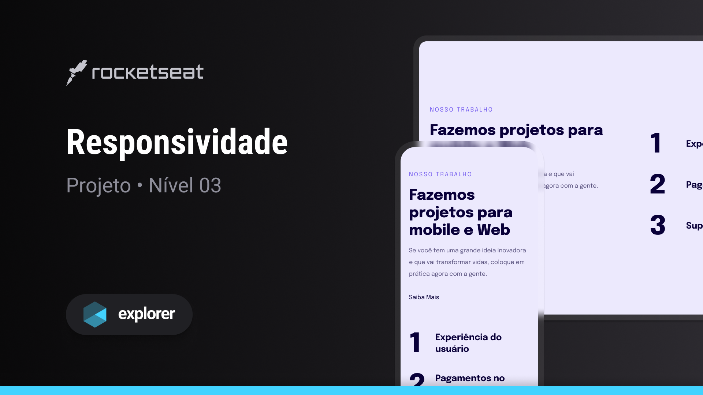

<h1 align="center">Responsividade</h1>

Explorer | Stage 03 - Projeto Responsividade

  <a href="#-tecnologias">Tecnologias</a>&nbsp;&nbsp;&nbsp;|&nbsp;&nbsp;&nbsp;
  <a href="#-projeto">Projeto</a>&nbsp;&nbsp;&nbsp;|&nbsp;&nbsp;&nbsp;
  <a href="#-licença">Licença</a>&nbsp;&nbsp;&nbsp;|&nbsp;&nbsp;&nbsp;
  <a href="#autor">Autor</a>

  

 

  

## 🚀 Tecnologias

Esse projeto foi desenvolvido com as seguintes tecnologias:

- HTML
- CSS

## 💻 Projeto

Este é um projeto aprendido durante o curso Explorer da [Rocketseat](https://www.rocketseat.com.br/).

Neste projeto foi construída uma página WEB com o mínimo de componentes possíveis, para focar especificamente na responsividade da página.
Fazendo com que seja possível visualizá-la de maneira agradável tanto em dispositivos móveis quanto em dispositivos com telas maiores.

Alguns dos conceitos e conhecimentos aplicados:

- Responsividade
- Mobile First
- Media queries
- Break points

## 📝 Licença

Esse projeto está sob a licença MIT.

## Autor

 

Feito com 💜 por Jordane Chaves